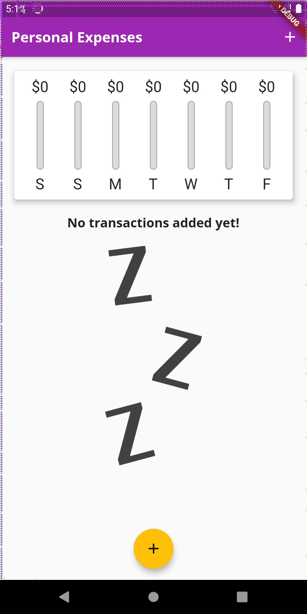
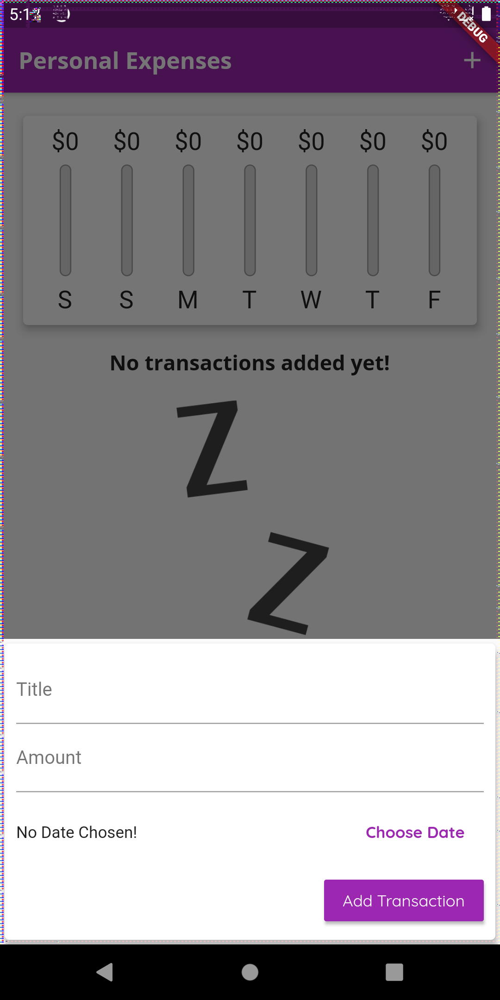
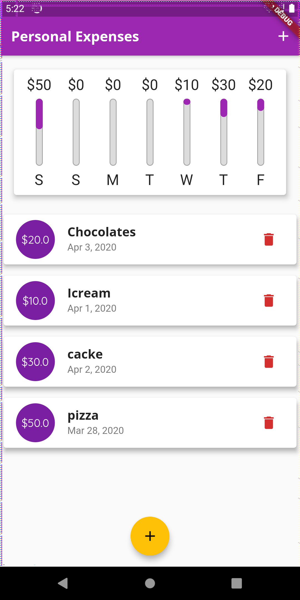

# Personal-Expenses

This is a Flutter app built for managing out personal expernses,our daily spend.
We can add all the expenditure we have made throughout the day.
This app also gives a statics of whole week, on money spent thorugout the week.

       
       

## Getting Started

This project is a starting point for a Flutter application.

A few resources to get you started if this is your first Flutter project:

- [Lab: Write your first Flutter app](https://flutter.dev/docs/get-started/codelab)
- [Cookbook: Useful Flutter samples](https://flutter.dev/docs/cookbook)

For help getting started with Flutter, view our
[online documentation](https://flutter.dev/docs), which offers tutorials,
samples, guidance on mobile development, and a full API reference.
